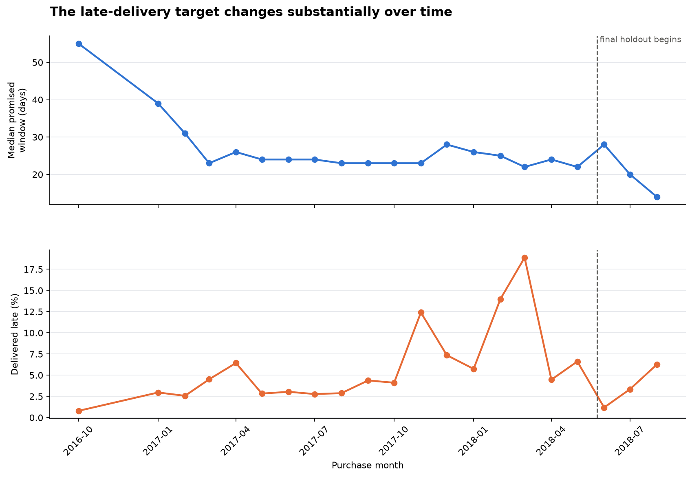
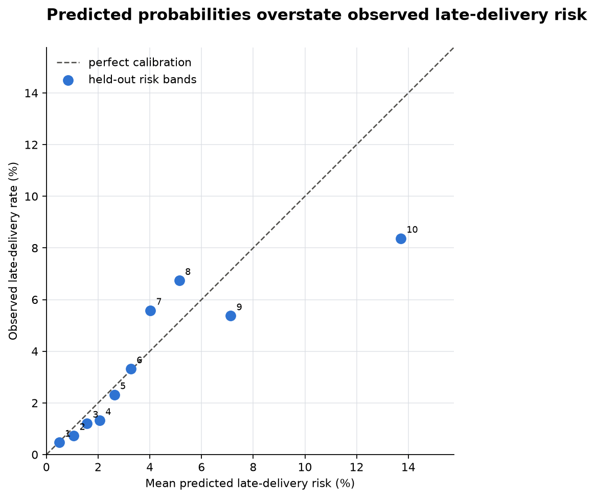
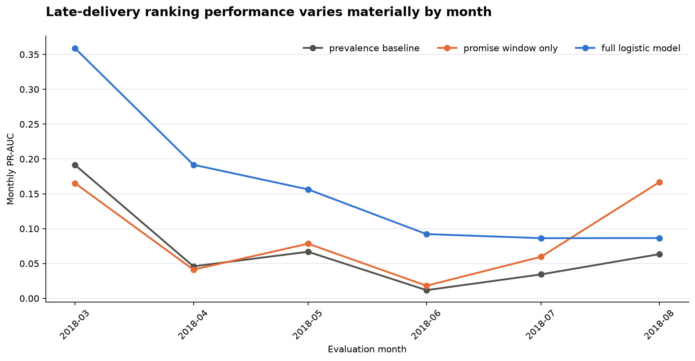
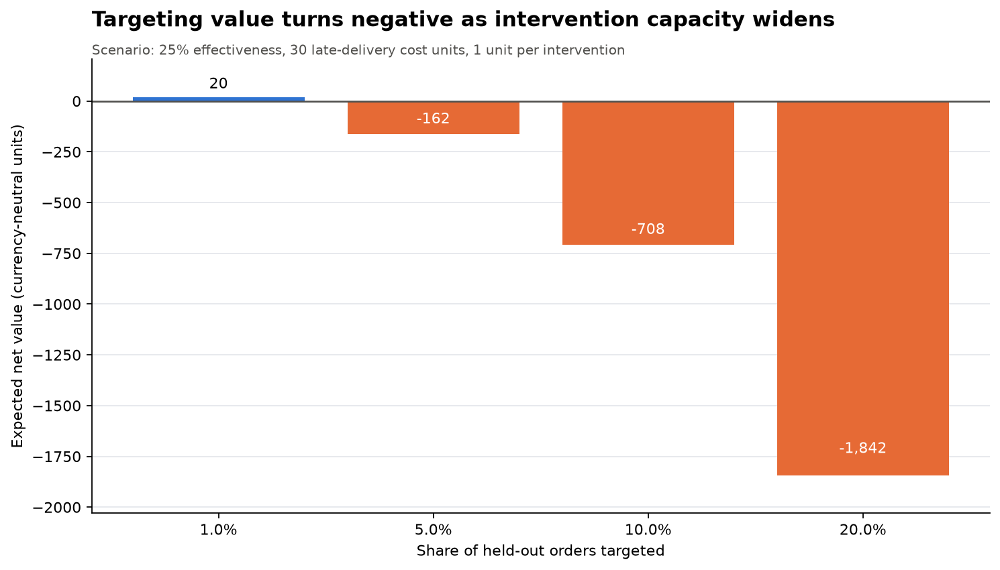

# Olist Delivery Risk and Customer Dissatisfaction

[](https://github.com/Yazeed69/olist-delivery-risk/actions/workflows/tests.yml)

An end-to-end data science project investigating how fulfilment failures relate
to customer dissatisfaction and whether late-delivery risk can be identified at
checkout.

The project turns seven raw Olist marketplace tables into a validated,
order-level analytical dataset, an adjusted statistical analysis, and a
chronologically evaluated prediction model.

## Results

- **93,306** reviewed orders form the dissatisfaction cohort, while **94,988**
  eligible delivered orders form the review-independent modeling cohort.
- Dissatisfaction rises from **8.2%** when both deadlines are met to **62–63%**
  when the customer-facing delivery promise is missed.
- After adjusting for order characteristics, product category, customer state,
  and seller-clustered uncertainty, a late customer delivery is associated with
  roughly **18–20 times** the odds of dissatisfaction compared with meeting
  both deadlines.
- Logistic regression is selected on an intermediate validation period, then
  reaches **0.715 ROC-AUC** and **0.080 PR-AUC** on a final untouched temporal
  holdout. The PR-AUC is about 2.27 times its **3.54%** prevalence floor.
- Its highest-risk 10% captures **23.6%** of held-out late deliveries
  (95% bootstrap CI **20.6–26.6%**) with **2.36× lift**
  (95% CI **2.06–2.66×**).

These are observational associations and held-out predictive results, not
causal estimates.


## Temporal drift and calibration

Late-delivery prevalence changes sharply across time: **7.85%** in model
training, **7.07%** in validation, and **3.54%** in the final holdout. The drop
is not explained by one stable trend. A wider median promised window coincides
with the unusually low June 2018 rate, but promised windows narrow again in
July and August while lateness rises. The target reflects both fulfilment
performance and Olist's changing promise policy.



The final model has a **0.0338 Brier score** and **1.21 percentage-point
expected calibration error**. Ranking remains useful, but the highest-risk
band materially overstates observed risk. Operational use
would therefore require ongoing recalibration rather than treating the scores
as stable probabilities.

Held-out permutation importance confirms that the promised delivery window
dominates the model: shuffling it reduces ROC-AUC by 0.273, while every other
feature reduces it by less than 0.004. The model is therefore recovering a
large amount of Olist's existing promise-setting policy rather than discovering
an independent operational signal.



## Baselines, backtests, and decision value

The validation comparison includes a constant prevalence baseline and a
promised-window-only logistic baseline. The full logistic model reaches 0.199
validation PR-AUC, versus 0.071 for prevalence and 0.069 for the promise-only
model, demonstrating incremental ranking value beyond the dominant feature.

Expanding-window backtests then score each of the final six calendar months.
They show genuine instability: full-model monthly ROC-AUC ranges from 0.603 to
0.794, and the promise-only baseline beats it in August 2018. The model card
therefore treats monthly monitoring and recalibration as requirements, not
optional production polish.



The intervention table converts ranking metrics into a transparent scenario.
Under explicitly replaceable assumptions—25% effectiveness, 30 units of cost
per late delivery, and 1 unit per intervention—targeting the riskiest 1% has
positive expected value, while wider 5–20% programs do not. This is a decision
framework rather than a claim of realized savings.



## Why single-seller orders?

Olist records one customer-delivery timestamp per order, even when an order is
split across multiple sellers. That makes seller-level handoff performance
ambiguous for multi-seller orders. The pipeline preserves a seller-count audit,
then restricts the main analysis to single-seller orders so each observed
delivery can be attributed coherently.

The anomaly is reported rather than hidden: two-seller orders have **46.6%**
dissatisfaction but only **1.0%** recorded lateness, versus 12.2% and 6.7% for
single-seller orders. Their median promised window is only one day longer
(25 versus 24 days), and reviews created before the recorded delivery are less
common, not more common (1.1% versus 5.1%). Those checks do not explain the
pattern. The order-level source schema still cannot identify which parcel a
single delivery timestamp represents, so parcel-level attribution remains
unresolved and these orders stay outside the main deadline analysis.

The dissatisfaction finding is also robust to its definition. With only
1-star reviews flagged, late-delivery groups are about 9.2 times baseline; with
1–3-star reviews flagged, they remain about 4.6 times baseline.

## Method

The pipeline performs the following sequence:

1. Load and validate the raw table schemas and source keys.
2. Resolve duplicate or conflicting reviews before joining them to orders.
3. Clean products, timestamps, order items, customer details, and geography.
4. Restrict the population to coherent, delivered, single-seller orders.
5. Engineer deadline outcomes, dissatisfaction, order controls, and
   checkout-time predictors.
6. Estimate Wilson confidence intervals, a chi-square association, and an
   adjusted binomial logistic model with standard errors clustered by seller.
7. Repeat the dissatisfaction analysis at 1-star, 1–2-star, and 1–3-star
   thresholds.
8. Compare prevalence and promise-only baselines with logistic regression and
   histogram gradient boosting on a chronological validation period.
9. Refit the selected model on development data and evaluate once on the
   untouched latest 20% of orders.
10. Run six expanding-window monthly backtests and a capacity-based economic
    scenario, then fit the deployment artifact on all eligible labeled data.
11. Measure target drift, calibration, and bootstrap uncertainty before
    exporting auditable tables and publication-ready figures.

All preprocessing for predictive models is fitted on training data only.
Post-checkout fields—including actual delivery timestamps and reviews—are
explicitly excluded from model features. Month, weekday, and hour use cyclical
encodings; purchase year is retained only for drift analysis and is excluded
from the predictive feature matrix.

## Repository layout

```text
src/
    olist_delivery/
        data.py             paths and raw-table loading
        cleaning.py         order-level cleaning transformations
        validation.py       runtime schema and invariant checks
        features.py         analytical and modelling features
        analysis.py         descriptive and adjusted statistics
        modeling.py         temporal evaluation and risk scoring
        visualization.py    publication-ready charts
        pipeline.py         end-to-end orchestration and CLI
        scoring.py          saved-model batch scoring
tests/                      focused tests for high-risk assumptions
scripts/download_data.py    source download and checksum verification
docs/MODEL_CARD.md          intended use, limitations, and monitoring
examples/scoring_input.csv  batch-scoring feature contract example
data/
    raw/                    downloaded source CSVs; not committed
    processed/              regenerated analysis cohort; not committed
outputs/
    figures/                generated portfolio figures
    metrics.json            key analysis and model results
    population_flow.csv     row-count audit from raw to final cohort
    delivery_drift.csv      monthly target and promised-window audit
    seller_count_diagnostic.csv
    dissatisfaction_sensitivity.csv
    model_validation_metrics.csv
    model_holdout_intervals.csv
    model_feature_importance.csv
    model_rolling_backtest.csv
    model_intervention_value.csv
    logistic_coefficients.csv
    late_delivery_model.joblib
pyproject.toml              package metadata and dependencies
requirements.lock           tested Python 3.12 environment
```

## Reproduce the project

Python 3.11 or newer is required.

```bash
python -m venv .venv
```

Activate the environment on Windows:

```bash
.venv\Scripts\activate
```

Or on macOS/Linux:

```bash
source .venv/bin/activate
```

Install the locked environment and editable package:

```bash
python -m pip install -r requirements.lock
python -m pip install -e . --no-deps
```

Download and checksum-verify the
[Brazilian E-Commerce Public Dataset by Olist](https://www.kaggle.com/datasets/olistbr/brazilian-ecommerce):

```bash
python scripts/download_data.py
```

The script verifies these required files in `data/raw/`:

```text
olist_customers_dataset.csv
olist_geolocation_dataset.csv
olist_order_items_dataset.csv
olist_order_reviews_dataset.csv
olist_orders_dataset.csv
olist_products_dataset.csv
olist_sellers_dataset.csv
```

Run the complete pipeline:

```bash
python -m olist_delivery.pipeline
```

The package also registers the shorter console command on systems that permit
Python-generated executable wrappers:

```bash
olist-delivery
```

Run the tests:

```bash
pytest
```

Score an engineered checkout-time CSV after running the pipeline:

```bash
olist-score examples/scoring_input.csv outputs/example_scores.csv
```

The model metadata and [model card](docs/MODEL_CARD.md) document the feature
contract, intended use, decision assumptions, monitoring, and failure modes.

The full pipeline runs in approximately 90 seconds on the development machine.
It regenerates `data/processed/olist_delivery_features.csv` and every file under
`outputs/`.

## Limitations

- Reviews are available only for orders that received a usable survey response.
  This affects the dissatisfaction analysis but no longer restricts the
  late-delivery modeling cohort.
- Straight-line seller-to-customer distance is a geographic proxy, not route
  distance.
- The held-out period has a much lower late-delivery rate than training. The
  drift analysis shows that changing promised windows explain part, but not all,
  of this non-stationarity.
- Held-out probabilities are imperfectly calibrated, particularly in the
  highest-risk band; the model is more defensible for ranking than for direct
  probability-based intervention.
- Rolling backtests show material month-to-month performance variation, and the
  promise-only baseline outperforms the full model in one evaluation month.
- Intervention economics are scenario results whose cost and effectiveness
  assumptions must be replaced before operational use.
- The historical Olist dataset may not reflect current marketplace operations.

## License

The project code is released under the [MIT License](LICENSE). The source data
is distributed separately by Olist through Kaggle and is not included here.
