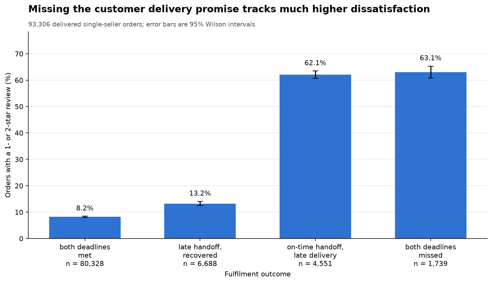
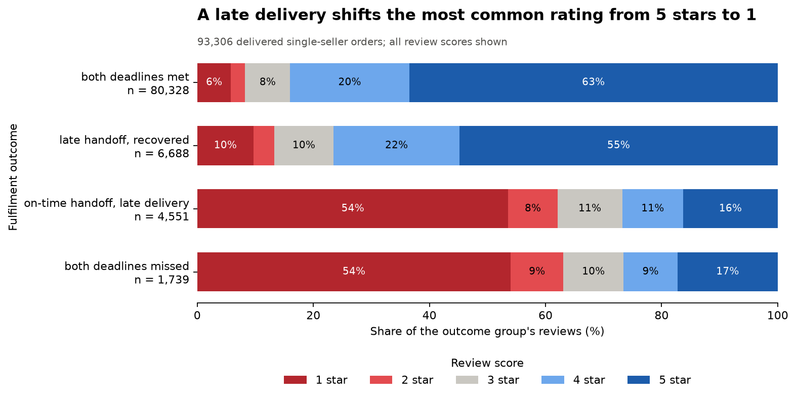
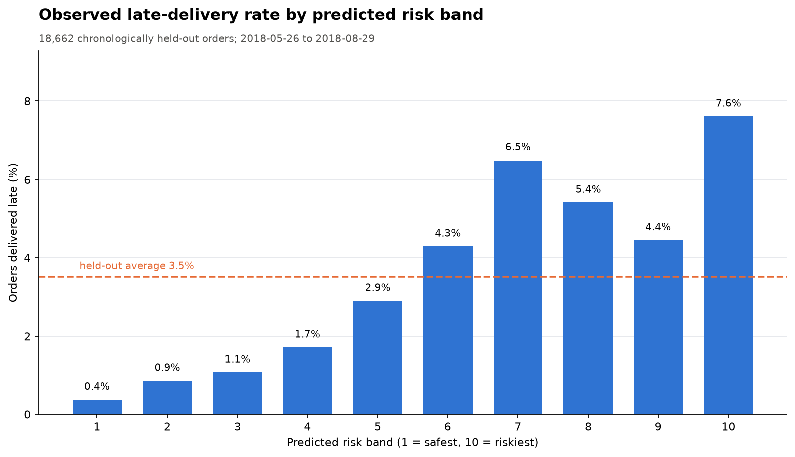

# Olist Delivery Risk and Customer Dissatisfaction

An end-to-end data science project investigating how fulfilment failures relate
to customer dissatisfaction and whether late-delivery risk can be identified at
checkout.

The project turns seven raw Olist marketplace tables into a validated,
order-level analytical dataset, an adjusted statistical analysis, and a
chronologically evaluated prediction model.

## Results

- **93,306** delivered, reviewed, single-seller orders form the final study
  population.
- Dissatisfaction rises from **8.2%** when both deadlines are met to **62–63%**
  when the customer-facing delivery promise is missed.
- After controlling for order characteristics, a late customer delivery is
  associated with roughly **18–20 times** the odds of dissatisfaction compared
  with meeting both deadlines.
- The selected checkout-time logistic model reaches **0.690 ROC-AUC** and
  **0.073 PR-AUC** on the latest 20% of orders. Its highest-risk 10% captures
  **21.6%** of late deliveries, a **2.16× lift** over the held-out base rate.

These are observational associations and held-out predictive results, not
causal estimates.







## Why single-seller orders?

Olist records one customer-delivery timestamp per order, even when an order is
split across multiple sellers. That makes seller-level handoff performance
ambiguous for multi-seller orders. The pipeline preserves a seller-count audit,
then restricts the main analysis to single-seller orders so each observed
delivery can be attributed coherently.

## Method

The pipeline performs the following sequence:

1. Load and validate the raw table schemas and source keys.
2. Resolve duplicate or conflicting reviews before joining them to orders.
3. Clean products, timestamps, order items, customer details, and geography.
4. Restrict the population to coherent, delivered, single-seller orders.
5. Engineer deadline outcomes, dissatisfaction, order controls, and
   checkout-time predictors.
6. Estimate Wilson confidence intervals, a chi-square association, and an
   adjusted logistic regression for dissatisfaction.
7. Compare logistic regression with histogram gradient boosting using a
   chronological 80/20 holdout.
8. Export the cohort audit, machine-readable metrics, and publication-ready
   figures.

All preprocessing for predictive models is fitted on training data only.
Post-checkout fields—including actual delivery timestamps and reviews—are
explicitly excluded from model features.

## Repository layout

```text
src/
    olist_delivery/
        data.py             paths and raw-table loading
        cleaning.py         order-level cleaning transformations
        validation.py       runtime schema and invariant checks
        features.py         analytical and modelling features
        analysis.py         descriptive and adjusted statistics
        modeling.py         temporal evaluation and risk scoring
        visualization.py    publication-ready charts
        pipeline.py         end-to-end orchestration and CLI
tests/                      focused tests for high-risk assumptions
data/
    raw/                    downloaded source CSVs; not committed
    processed/              regenerated analysis cohort; not committed
outputs/
    figures/                generated portfolio figures
    metrics.json            key analysis and model results
    population_flow.csv     row-count audit from raw to final cohort
pyproject.toml              package metadata and dependencies
```

## Reproduce the project

Python 3.11 or newer is required.

```bash
python -m venv .venv
```

Activate the environment on Windows:

```bash
.venv\Scripts\activate
```

Then install the package and test dependencies:

```bash
python -m pip install -e ".[dev]"
```

Download the [Brazilian E-Commerce Public Dataset by Olist](https://www.kaggle.com/datasets/olistbr/brazilian-ecommerce)
and place these files in `data/raw/`:

```text
olist_customers_dataset.csv
olist_geolocation_dataset.csv
olist_order_items_dataset.csv
olist_order_reviews_dataset.csv
olist_orders_dataset.csv
olist_products_dataset.csv
olist_sellers_dataset.csv
```

Run the complete pipeline:

```bash
python -m olist_delivery.pipeline
```

The package also registers the shorter console command on systems that permit
Python-generated executable wrappers:

```bash
olist-delivery
```

Run the tests:

```bash
pytest
```

The full pipeline runs in approximately 25 seconds on the development machine.
It regenerates `data/processed/olist_delivery_features.csv` and every file under
`outputs/`.

## Limitations

- Reviews are available only for orders that received a usable survey response.
- Straight-line seller-to-customer distance is a geographic proxy, not route
  distance.
- The held-out period has a lower late-delivery rate than the training period,
  demonstrating temporal drift and limiting model calibration.
- The historical Olist dataset may not reflect current marketplace operations.

## License

The project code is released under the [MIT License](LICENSE). The source data
is distributed separately by Olist through Kaggle and is not included here.
